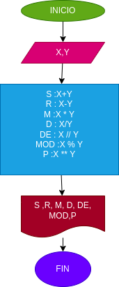

# OPERACIONES ARITMETICAS
un programa para calculr sumas,restas,multiplicaciones,divisiones,divisiones enteras,modulo,potencia
## calcular mediante 2 numeros enteros varias operaciones aritmeticas

# analisis

variable de entrada

X y Y : 2 numeros naturales ingresados para sacarles sus operaciones aritmeticas respectivas

variables de salida 

s=x+y
r=x-y
m=x*y
d=x/y
de=x//y
mod=x%y
p=x**y

# diseño

# construccion
